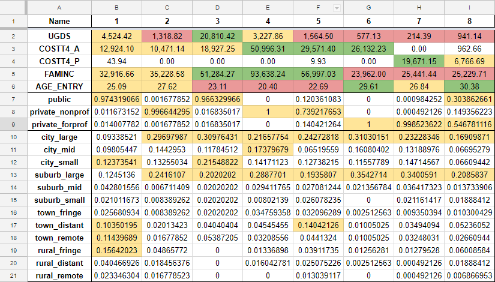

<style>
body {text-align: justify}
p {text-indent: 50px}
</style>

```{r setup, include=FALSE}
knitr::opts_chunk$set(echo = FALSE)
```

## **Capstone Project**

### **Introduction**

The [**College Scorecard**](https://collegescorecard.ed.gov/) is a service meant to help prospective students make their college decision. Whether by comparing size, popular majors, or comparing costs to the national average, the site's goal is to help the user find a good fit. For my Springboard Capstone Project, I used the [**dataset**](https://catalog.data.gov/dataset/college-scorecard) made available by the College Scorecard to try and find additional ways to help users in their decision. 

### **The Data**

Available in a .zip file from the link above, the data is split into 19 .csv files - one for each academic year from 1996-'97 to 2014-'15. Each file contains 1,744 recorded data points (columns) and about 7,500 schools (rows). My first step was to add a DATAYEAR column to indicate the academic year and then merging the 19 files into one large .csv, which I called **fulldata.csv**. From this 2 GB file, I would create subsets for plotting and studying trends. Next, I had to refer to [**the data dictionary**](https://collegescorecard.ed.gov/data/documentation/) to understand the column names and some of the placeholder values used. Once I merged the files and had a basic understanding of what data was available, I began to create some plots and documented my initial findings in my [**data story**](http://varun.pro/Springboard/DataStory/collegescorecard.html). As a note, my studies have been on US schools only. The dataset includes records of US territories as well, but I have filtered them out when creating subsets for plotting/modeling. 

### **Deliverables**

My first item will be using linear regression models to determine what variables are the most influential on the cost of a school, and to potentially predict what the cost of a school may be in the future. This would be useful in two ways. It could help students who are on the fence about going to college immediately after high school by suggesting a decline in cost. If a student sees that their ideal school is likely to be cheaper in two years, they may make the decision to find entry-level work or go traveling before going to college. It could also help the schools by indicating areas of their budget that are influencing the cost of attendance. Of course, the goals of each school are different and they may not be interested in reducing cost, but if a school is experiencing a decline in applications, cost of attendance is likely to be something they look at. 

The second item is a recommendation tool that works similarly to clustering methods used by media services such as Netflix, YouTube, and iTunes. Clustering based on things like location, cost, and SAT scores, a student can find options that are close to their top choice. Mentality is a very important part of finding success at school, and feeling out of place in freshman year can be quite discouraging. If their top choice is a far reach school, or it is too expensive/too far, then finding alternatives would hopefully help them to be satisfied in their decision.

My final item will be a basic UI that allows the user to explore the dataset on their own. Although the data will need to be curated and shaved down to a size that a standard internet browser can handle, my hope is that it will provide some transparency between students and universities. As an example, in my [**data story**](http://varun.pro/Springboard/DataStory/collegescorecard.html), I explored SAT averages and admission rates. Even though one could reasonably guess how they are related (higher SAT scores ~ lower admission rates), being able to plot the data and draw a conclusion from a graph is much more convincing. By putting this power in the hands of students and their families, they should be able to make much more educated decisions.

### **Data Preparation**

From **fulldata.csv**, I created and saved a subset of the columns that would make repeated data manipulation more manageable. I named it **subdata** and it contains various *school identification data* (name, ID, location, level of institution), *admission data* (student demographics, SAT scores), *education data* (majors, completion rates), and *financial data* (cost, aid, debt, repayment). 

From this subset, I can pick the variables for the cost modeling, as well as the variables for clustering - both tools will get specific subsets made so that the data is organized and loading it will be easier in the future. A combination of the original source data and my curated data will go into the UI plotting tool, keeping in mind that the dataset should stay a reasonable size but also have enough depth for the user to gain whatever insights they can.

### **Cost Prediction**

For convenience, I began by changing the DATAYEAR column from indicating the year range ("1996-'97") to simply having the start year ("1996"). Using the datayear, I created the training file using years 1996 to 2013 and the test file with just the 2014 data. Since the cost is known for 2014, we can compare afterwards to see how good the model is beyond the $R^2$ score alone.

From **subdata**, I created a subset of up to 14 columns that I felt would be related to the attendance cost of a school. This included columns like "CONTROL" (whether the school is public or private), "UGDS" (the undergraduate student population), "PFTFAC" (percentage of faculty that are full time), and of course "COSTT4_A" (cost of attendance for a 4-year academic year school). Upon checking the summary() of the training set, I noticed that the MAX of "UGDS" was unnaturally high. This was because there were a few records of the University of Pheonix's online campus, which is capable of having about 200,000 students. Since this was skewing the data, I removed its related "OPEID6" from the training and test sets. I also removed all records in the training set that did not have a "COSTT4_A" entry, since they would not contribute to the model. This filtering had an interesting byproduct - apparently years 2008 and prior did not have "COSTT4_A" records, so removing the NA entries also happened to filter the dataset to years 2009 and beyond. After taking care to turn appropriate columns into the numeric data type, I moved on to make small experimental models.

The first model I tried was on Cost by Undergrad Pop., Average Faculty Salary, and % of Faculty that are Full-Time. This, however, only gave an $R^2$ of 0.2198, which is not that great. However, the model summary suggests that these three variables are still significant (using asterisk notation), so it is a step in the right direction. The 2nd model I tried used 12 independent variables to model Cost. It gave an $R^2$ of 0.8253, but still showed that three of the variables had little to no significance. After removing these, this was the final model I came to:

#### *Cost by Datayear, Highest degree offered, Pub/Priv, Avg SAT, Undergrad Pop., Avg Faculty Salary, % of Faculty that are Full-Time, Median Debt, and Avg Family Income*

```{r costmodel, message=FALSE, warning=FALSE, fig.align="center"}
# load libraries
library(readr)

df.train <- read_csv("data/df_train.csv")

cost.mod <- lm(COSTT4_A ~ DATAYEAR + HIGHDEG + CONTROL + SAT_AVG + UGDS + AVGFACSAL + PFTFAC + DEBT_MDN + FAMINC, data = df.train, na.action = na.omit)

summary(cost.mod)

```

With an $R^2$ of 0.825, this model is almost equally as good as the second model, but now all of the variables used are significant. In other words, the variables that likely have the most influence on the cost of attendance of a school are the ones in this model. This is saved as **cost.mod** and will be used to predict on the test set.

#### *Summary of test data after predictions*

```{r costpredict, message=FALSE, warning=FALSE, fig.align="center"}
# load libraries
library(readr)

df.test <- read_csv("data/cost_predict.csv")

summary(df.test)
```

The predict() formula returns a column that I named "PREDICT" and, by taking the difference of "PREDICT" and "COSTT4_A", we can see whether the prediction was too high or too low. This summary tells us that the extreme cases were -\$15,605 and \$26,866 off the mark. What is more disappointing, however, is the number of NAs in the prediction output. To see where the model is falling short, I can check two plots. The first plot overlays the prediction values (in black) over the training data. This helps to see if the predicted values stayed in the same range and may indicate another reason why some predictions weren't made. The second plot overlays the prediction values over the actual 2014 values, and they are coloured green if within $4000 of the actual cost and red if predicted too far. If the plot is mostly green, that would be a good sign.

```{r predictplot1, message=FALSE, warning=FALSE, fig.align="center"}
# load libraries
library(readr)
library(ggplot2)


df.test <- read_csv("data/cost_predict.csv")

# plot training set (see costs by ID) and plot the predictions over it (see how the spread looks)
plot1 <- ggplot(NULL, aes(OPEID6, COSTT4_A)) + 
  geom_point(data = df.train, aes(col = as.factor(REGION))) + 
  geom_point(data = df.test, aes(y = df.test$PREDICT)) +
  labs(x = "OPEID6", y = "COSTT4_A", 
       title = "Prediction (Black) vs. Training (Coloured)") + 
  scale_colour_discrete(name = "Region", 
                        labels = c("US Service Schools", "New England", "Mid East", "Great Lakes", "Plains", "Southeast", "Southwest", "Rocky Mountains", "Far West", "Outlying Areas"))

# plot predictions over the actual for 2014
plot2 <- ggplot(NULL) + 
  geom_point(data = df.test, aes(df.test$OPEID6, df.test$COSTT4_A), 
             col = "black") + 
  geom_point(data = df.test, aes(df.test$OPEID6, df.test$PREDICT), 
             col = ifelse(abs(df.test$DIFF) <= 4000, "green", "red")) +
  labs(x = "OPEID6", y = "COSTT4_A",
       title = "Prediction (Red/Green) vs. Actual (Black)")

plot1
plot2

```

According to these plots, the predictions were mostly succesful for schools in the 0 ~ 3000 range for "OPEID6", while predictions beyond that are very sporadic. Looking at the dataset and sorting by "OPEID6" shows that there are many NAs in the independent variables, causing the prediction to fail for those cases. This is unfortunate, since this causes about 2,600 failed predictions despite a fairly strong model. This leaves us with a few different options. We could remove the independent variable(s) with the most NAs from the model, which risks weakening the model but will yield more successful predictions. Another option could be to replace NAs with another value, such as the mean for that column. This doesn't hurt the model at all, but the predictions for the schools with approximated values have a chance to be completely off.

The independent variable with significantly more NAs than the others is "SAT_AVG". We can create a new model that does not include "SAT_AVG" and, it turns out, removing it reveals "PFTFAC" to be an insignificant variable as well. With both removed, the new model has an $R^2$ of 0.771, which is not bad at all. Checking the summary of this new model shows that there are only about 400 NAs in the prediction this time, which is a massive improvement. 

```{r temptest, message=FALSE, warning=FALSE, fig.align="center"}
# load libraries
library(readr)
library(tidyr)

df.train <- read_csv("data/df_train.csv")

mod1 <- lm(COSTT4_A ~ DATAYEAR + HIGHDEG + CONTROL + UGDS + AVGFACSAL + DEBT_MDN + FAMINC, data = df.train, na.action = na.omit)

summary(mod1)
```

We can compare the performance of this model to the other option, where NAs would have been replaced by the column mean. Is it worth it to have a slightly weaker model for more accurate predictions, or will replacing the NAs solve the problem? Ideally, the colour coding of the plot will indicate the better model.

```{r comparemod, message=FALSE, warning=FALSE, fig.align="center"}
# load libraries
library(readr)
library(ggplot2)

temp.test <- read_csv("data/temp_test.csv")
df.test.approx <- read_csv("data/cost_predict_approx.csv")

# plot temp predictions over the actual for 2014
ggplot(NULL) + 
  geom_point(data = temp.test, aes(temp.test$OPEID6, temp.test$COSTT4_A), 
             col = "black") + 
  geom_point(data = temp.test, aes(temp.test$OPEID6, temp.test$PREDICT), 
             col = ifelse(abs(temp.test$DIFF) <= 4000, "green", "red")) +
  labs(x = "OPEID6", y = "COSTT4_A",
       title = "Weaker Model, Fewer NAs")

# plot temp predictions over the actual for 2014
ggplot(NULL) + 
  geom_point(data = df.test.approx, aes(df.test.approx$OPEID6, df.test.approx$COSTT4_A), 
             col = "black") + 
  geom_point(data = df.test.approx, aes(df.test.approx$OPEID6, df.test.approx$PREDICT), 
             col = ifelse(abs(df.test.approx$DIFF) <= 4000, "green", "red")) +
  labs(x = "OPEID6", y = "COSTT4_A",
       title = "Original Model, NAs replaced")

```

It truly looks as though the weaker model with a few NAs remaining is the better one for prediction. The amount of red in the NA-replacement model shows that many predictions were quite off and that forcing the model to make predictions when there was not enough data was the wrong decision. Giving up the two variables and using a slightly weaker model, while keeping the original data, seems to stay within the range of the actual 2014 data for the most part. 

If we plot this new model, we can also use the residuals to judge how well it works.  

```{r modelsumm, message=FALSE, warning=FALSE, fig.align="center"}
# load libraries
library(readr)

df.train <- read_csv("data/df_train.csv")

cost.mod2 <- lm(COSTT4_A ~ DATAYEAR + HIGHDEG + CONTROL + UGDS + AVGFACSAL + DEBT_MDN + FAMINC, data = df.train, na.action = na.omit)

plot(cost.mod2)
```

The Residuals vs Fitted plot stands out right away, showing that the residuals generally reside around the fitted line. The Normal Q-Q plot also follows the normal line for the most part, aside from the very bottom and very top of the plot. It seems like this model is fairly strong, and the $R^2$ and plot of residuals reinforces it.

After revisions, the current conclusion is that Cost is strongly related to the school's highest provided degree, whether it is public or private, the student population size, the average faculty salary, the median student debt, and the average family income. It is unlikely that the school will change between public/private, or that it will stop providing higher degrees, but there is a chance that the school might look into its admission rates. According to the coefficients table, "UGDS" is negatively correlated to "COSTT4_A", which means that school prices go up as student population sizes go down; i.e., fewer people go to the more expensive schools, and the schools that accept the most students can afford to have slightly lower attendance costs since they make it back through sheer numbers. 

It should also be mentioned that the $4,000 "acceptable" window I applied to the prediction values was chosen arbitrarily. This window could change depending on the student's budget - someone who is more well-off could widen the window and someone with a tighter budget could shrink it. Despite removing some of the variables that made what seemed to be a stronger model, the final model we reached seems rather good at predicting cost when all data points are present.

### **School Recommendation**

From **subdata**, I created another subset for clustering. Since the plan is to have a way to recommend schools to a student, I filtered down to just the school data from 2014 (meaning the 2014-'15 school year). Since this is the most recent year of data available in the dataset, it felt the most appropriate to use when trying to classify them. With some trial and error, I eventually decided on 9 variables to use, aside from the school name column. At this point, I made two subsets - **clustdata** for performing data manipulation, and a copy called **schoolCluster2014** which would remain as is until the end when we have clusters to assign. 

Proper data cleaning was important here, since calculating Euclidean distance is the first step to building the clustering model. I needed to scale() the numeric variables, so that variables with different ranges do not skew the model. However, before scaling, there were a few changes I had to make to the data. 

For population size, family income, and age of entry, I replaced NAs with the mean of the column. The two cost columns were different - one column shows the cost of academic year schools and the other is for program year schools, meaning if one column had an entry, the other would be NA. In this case, it wouldn't make sense to replace NAs with the mean, so I replaced them with 0 instead. With the NAs filled, we can run scale(clustdata[2:6]), where the 2nd to 6th columns are the numeric variables. After handling the NA values, I also had to check the mean() and sd() so I could note them down. I kept these in a spreadsheet for later, since I will need them to change the scaled values back to ones we can make sense of for analysis.

I also transformed the categorical variables into their own binary columns - instead of checking the row for the value in the cell, the value is in the column name and the cell is a 1 or 0. This meant adding 51 columns for the states and DC, 3 columns for public or private (for-profit and non-profit), and 12 columns for different locale types (city, town, etc). After adding the new binary columns, the original columns were removed. 

After these changes, we can run dist(clustdata[2:72]) to get the Euclidean distances for the schools. With the distances, we can then create a cluster object, which can be used to plot a dendrogram. This will give us an idea of how many clusters we should create from the dataset.

```{r dendrogram, message=FALSE, warning=FALSE, fig.align="center"}
# load libraries
library(readr)
library(cluster)

clustdata <- read_csv("data/clustdata.csv")
clustdata[2:6] <- scale(clustdata[2:6])
distances <- dist(clustdata[2:72], method = "euclidean")
clusterSchools <- hclust(distances, method = "ward.D")

# create dendrogram
plot(clusterSchools)
# there is a spot where horizontal line rule gives us 8 clusters
rect.hclust(clusterSchools, k = 8)
```

Using a horizontal line, we can cut the dendrogram to help us decide how many clusters to use. If we cut higher up, we would not have enough clusters to give meaningful recommendations. The red boxes here show a spot that crosses the dendrogram 8 times.

The next step involved a little bit of manual work outside of R. I used tapply() to find the mean occurrences for the variables in each cluster, copy/pasted the values into a text editor, and made a .csv manually. This file will show us what values are most common in the cluster, allowing us to come up with classifications. For the numeric variables, the value here will tell us the mean (of the scaled value) in that cluster - for example, telling us the mean cost is high or the mean population is low. And the binary columns will just be $\frac{N}{7542}$, where N is the number of "1" values and 7542 is the number of schools - this gives us an easy percent. 

#### *Cluster Means*

```{r makecsv, message=FALSE, warning=FALSE, fig.align="center"}
# load library
library(readr)

clustermeans <- read_csv("data/clustermeans.csv")

clustermeans
```

Since the first five rows are still scaled, it is hard to make classifications without context. That is why I kept the mean() and sd() of the unscaled values beforehand. To convert back, we just use 

$$ x = (sd\times z) + m $$

Now we can understand the numeric values since they are in their original units. Using Google Sheets, I did some colour coding to see which values here stood out. Some clusters are a bit more distinct than others, but 8 seems to have been a good choice. Yellow cells are close to the original mean(), green cells are above, and red cells are below. Although the colouring is a bit arbitrary from my end, the values are fortunately different enough to make unique clusters. I also checked the count of each of the clusters to see how many schools were placed into them, which could also help determine if the classifications we decide on make sense.

<center></center>

```{r clustertable, message=FALSE, warning=FALSE, fig.align="center"}
clusterSchools <- hclust(distances, method = "ward.D")
clusterGroups <- cutree(clusterSchools, k = 8)
table(clusterGroups)
```

Based on all of these factors, I came up with the following classifications:

1. Public, Medium Pop, Mid Cost (A), Mid Family Income, Mid 20s, Varying Locales
2. Private Non-Prof, Low Pop, Mid Cost (A), Mid Family Income, Mid 20s, Large City/Suburb
3. Public, High Pop, Mid Cost (A), High Family Income, Low 20s, Large City/Suburb
4. Private Non-Prof, Medium Pop, High Cost (A), High Family Income, Low 20s, Large City/Suburb
5. Private Non-Prof, Low Pop, High Cost (A), High Family Income, Low 20s, Large City/Suburb
6. Private For-Prof, Low Pop, High Cost (A), Low Family Income, Upper 20s, Large City/Suburb
7. Private For-Prof, Low Pop, High Cost (P), Low Family Income, Mid 20s, Large City/Suburb
8. Public/Private For-Prof, Low Pop, Mid Cost (P), Low Family Income, Upper 20s, Large City/Suburb

There are some interesting take-aways from this already. It is pretty unsurprising that the majority of public schools are in cluster 1, where student population, cost, and family income are all around average, and cluster 7, where students are joining for-profit schools to try and gain new skills in their mid-20s since their incomes are on the lower side. Cluster 1 is also not dominated by any one locale, though the most are small towns or cities. Clusters 3, 4, and 5 also seem to indicate that the students going to schools in large locales are younger, have higher family incomes than the others, but still have different preferences on population and cost of their school.

Finally, we can append the clusters to the end of the original data. Earlier in the process I made a table called **schoolCluster2014**, to which I can now assign clusters. Now if a student has a school in mind, for example "Drexel University", they can do a lookup for that school and see what cluster it is in. In this case, Drexel is in cluster 4.

#### *Cluster 4*

```{r clust4, message=FALSE, warning=FALSE, fig.align="center"}
# load library
library(readr)

schoolCluster2014 <- read_csv("data/schoolcluster2014.csv")

subset(schoolCluster2014, CLUSTER == 4)
```

With an interactive UI, a student could now sort by population, cost, and compare schools based on their own preferences and needs. This brings us to the next and final tool.

### College Scorecard Sandbox

